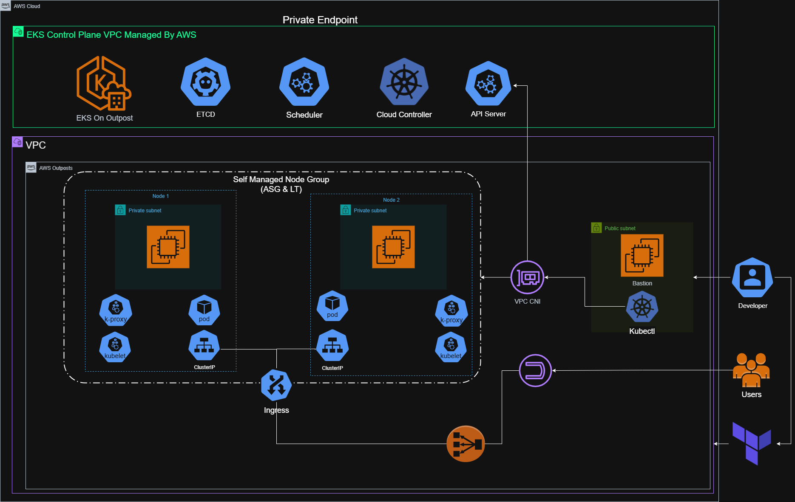

# private-eks-cluster-on-cloud-and-on-outposts  
<p align="center">
  <strong>Seamless, Secure, On-Prem Kubernetes Powerhouse</strong>
</p>

<p align="center">
  
  
  
</p>

<p align="center">
  Built with the tools and technologies:<br/>
<p align="center">
  
  
  
</p>
</p>

---

## 📦 Overview

This project provisions a **fully private EKS cluster** running **entirely on AWS Outposts**, including:

- **Control Plane** deployed on Outposts
- **Worker Nodes** deployed on Outposts via Auto Scaling Group
- Full **VPC networking**, **IAM roles**, **launch templates**, and **cluster bootstrapping**
- Secure and isolated Kubernetes deployment with **no public endpoint exposure**



---

## 🚀 Installation

Build `private-eks-cluster-on-cloud-and-on-outposts` from source and install dependencies:

### 1. Clone the Repository
```bash
git clone https://github.com/Hendawyy/private-eks-cluster-on-cloud-and-on-outposts
cd private-eks-cluster-on-cloud-and-on-outposts
````

### 2. Initialize Terraform

```bash
terraform init
```

### 3. Plan and Apply

```bash
terraform plan
terraform apply
```

> ⚠️ Ensure AWS credentials are properly configured on the bastion or your environment.

---

## 🧱 Infrastructure Overview

This infrastructure includes:

* **VPC with 3 private subnets 1 public subnet on outposts 2 private subnets on cloud region for EKS Control plane components**
* **Self-managed EKS cluster** deployed using `aws_eks_cluster`
* **Worker Node Group** created using:

  * `aws_launch_template`
  * `aws_autoscaling_group`
* **IAM Roles and Instance Profiles** for:

  * Cluster control plane
  * Worker node identity
* **Remote bastion access and provisioning via `null_resource`**
* **User data validation and SSH key bootstrapping**


---

## 🔐 Authentication & Bastion Setup

Bastion host is configured using a Terraform `null_resource` to SSH into the remote EC2 instance and run:

* `aws eks update-kubeconfig` to authenticate the user with the cluster
* This assumes the EC2 has the correct instance profile with `eks:DescribeCluster` permissions

---

## ⚙️ Tools & Dependencies

* [Terraform ≥ v1.5](https://www.terraform.io/downloads)
* AWS CLI with configured profile or instance role
* Valid EC2 Key Pair (`.pem`) for bastion SSH access

---

## 📌 Key Variables

| Variable             | Description                        |
| -------------------- | ---------------------------------- |
| `prefix`             | Prefix for all named AWS resources |
| `Cluster_Name`       | Name of the EKS Cluster            |
| `Private_Subnets_ID` | List of private subnet IDs         |
| `Outposts_ARN`       | ARN of the AWS Outposts instance   |

---

## 📄 License

This project is licensed under the MIT License.

---

## 👤 Author

[🔗**Seif Hendawy**](https://www.linkedin.com/in/hendawyy/)

📦 GitHub: [Hendawyy](https://github.com/Hendawyy)
